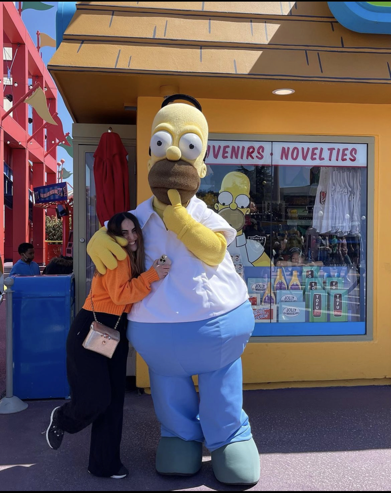

# Introduction 
*My name is Ayah Aldawsari, and I am an international student from Saudi Arabia. I am in my fourth year at UCSD majoring in Computer Engineering.* 

## More About Me
- *I am a self-learner: my first language is Arabic, but I have taught myself English, and I am currently learning Turkish! I also taught myself how to play the piano!*
- *I like staying active and engaging in sports as much as I can. I play tennis, and volleyball, and I ski!. Click on this link to see my favorite place to ski, [palisades tahoe](https://www.palisadestahoe.com/) **I learned all these sports 4 years ago when I came to the US!***
- *I like a balanced life and as my brother always tells me*
> "The right thing is between two wrongs."- My older brother.
- Favorite animal
- [x] Cats
- [ ] Dogs
- [click to see a cute picture of my cat](IMG_7169.jpg)
### Interests
*Throughout my Computer Engineering studies at UCSD, I discovered that I have enjoyed my electrical engineering classes more than my computer science classes. I have found myself more passionate and interested in the electrical engineering classes topics, such as signal processing and circuit design. 
Despite this, I do not regret doing computer engineering at UCSD since it has taught me more about myself and opened my eyes to what I like and what I do not.*

### Programming languages and Tools
1. C++
2. Java
3. Python
4. Matlab
5. Verilog
6. Kicad
7. LTspice
8. SolidWorks
9. Quartus
10. Questa

#### Go to
- [Introduction](#Introduction)
- [More about me](#More-About-Me)
- [Interests](#Interests)
- [Programming languages and Tools](#Programming-languages-and-Tools)

